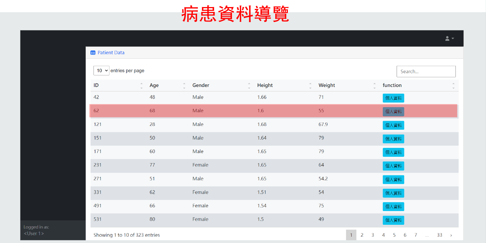
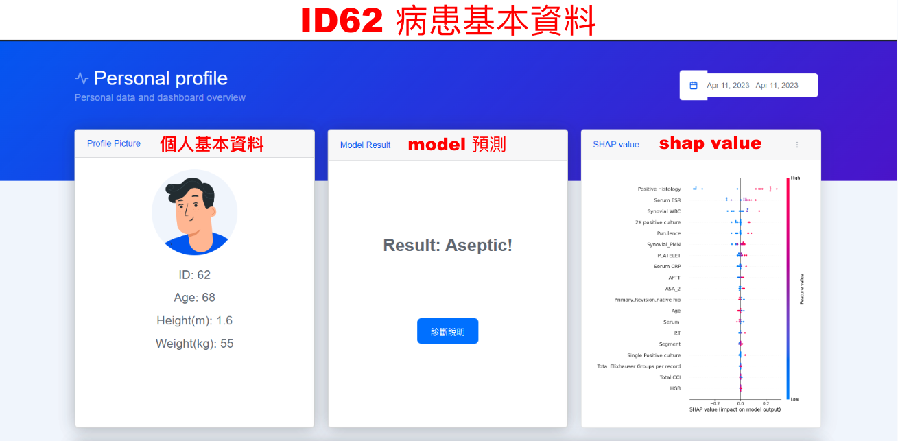
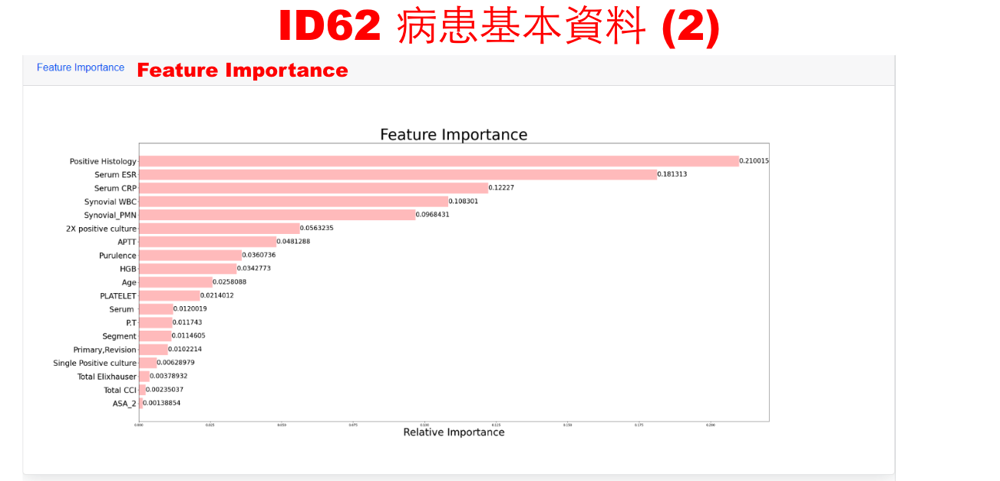
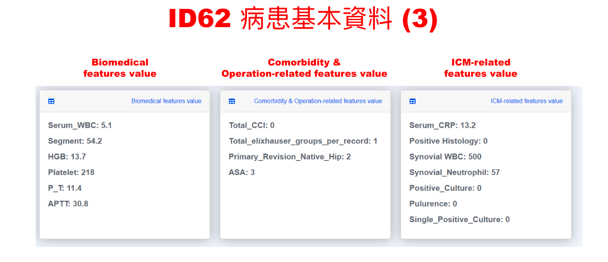

# PJI_flask

Based on the machine learning model proposed in preliminary research, this system further develops an efficient pre-diagnosis system for prosthetic joint infections. Utilizing the Random Forest model to interpret the predictions of a stacking model, the system significantly improves its application efficiency in actual medical environments through meticulous numerical adjustments and simplification of decision rules. The system adopts an internet-based architecture, integrates front-end and back-end web application technologies, and leverages Docker container technology for deployment, thereby enhancing the system's portability and scalability.

## Introduction


Test account and password：  
Account:test  
Password:1234  

  
After logging in, the user is taken to the homepage, which is a navigation page for patient data. Users can view the basic information of all current patients. The horizontal axis lists basic information such as patient age, gender, height, and weight, while the vertical axis lists the patient's ID. This page defaults to displaying 10 entries. If users wish to view additional data, they can click on the page numbers below to select them. If they want to view more data at once, they can adjust this by dragging the bar at the top left of the page. To quickly find specific data, users can use the search bar at the top right of the page.  


  
The patient's basic information page includes:  
(1) Important personal basic information  
(2) Predictions from the stacking model  
(3) The SHAP values on the right and the feature importance below both indicate the importance of each feature.  
Here, the horizontal axis of the SHAP value chart represents the SHAP values, while the vertical axis lists the names of the features. SHAP (SHapley Additive exPlanations) values are one of the methods for interpretability in machine learning models, used to explain the prediction results of the model and the importance of each feature in making predictions. They help us understand how the model makes decisions, thereby increasing the model's interpretability and trustworthiness. In this chart, for example, if the impact of a SHAP value on the model's output is positive, it will be shown in red; if negative, it will be shown in blue.  


  
Scrolling down to the feature importance section, Feature Importance is based on the Random Forest model. It assesses the impact of each feature on the model's output by measuring its degree of influence. This method allows us to quickly understand which features have the most significant impact on model predictions, facilitating feature selection and optimization.


Next, we scroll down, and this section lists the values for all features of this data entry. The features are organized as follows:
On the left, features related to biomedical aspects,
In the middle, features related to comorbidity,
On the right, features related to ICM (Infection Control Measures).


Next, we return to the top and enter the diagnostic explanation section. When you press the diagnostic explanation button, the system will display the diagnostic pathway diagram, starting from the left side.

## Installation

Instructions to install the project:

```bash
git clone https://yourproject.git
cd yourproject
npm install
